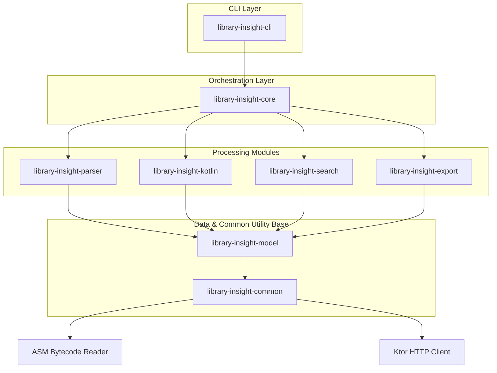

# Library Insight 🔍

Library Insight is a command-line tool that analyzes Java and Kotlin libraries (JAR/AAR) to inspect, extract, and index their complete public API surface from compiled bytecode and Kotlin metadata.

Instead of requiring source code, the tool reads compiled `.class` structures (using ASM) and `@Metadata` annotations (using `kotlin-metadata-jvm`) to construct an accurate public API index.

This is incredibly useful for:

- Documentation generation
- API compatibility verification (checking for breaking changes)
- IDE extensions and indexing engines
- Context generators supplying AI assistants with exact signatures

---

## Key Features

- **Multi-Format Support**: Reads JARs, AARs (including nested JARs), directories, and Gradle build outputs.
- **Deep Metadata Extraction**:
  - **Classes/Interfaces/Objects**: Modifiers, companion objects, data/value flags, annotation markers, nested declarations, interfaces, inheritance.
  - **Constructors & Methods**: Visibility, parameter names, default arguments, return types, generic signatures/bounds, extension receivers, operators, infixes, inline, and suspend keywords.
  - **Properties**: Mutability (`val`/`var`), const declarations, lateinits, backing fields, and custom accessors.
- **Format Exporters**: Converts API indices to structured **JSON** or highly readable **Markdown** reference documentation.
- **Search Engine**: Performs case-insensitive searches across packages, classes, methods, and properties.
- **Diff Engine**: Compares two versions of a library to highlight added, removed, or changed APIs, deprecations, and **binary breaking changes** (like visibility reduction, method deletion, or changing suspend modifiers).
- **AI-Context Exporter**: Generates a compact, token-efficient `ai-context.json` file optimized for LLMs (ChatGPT, Gemini, Claude, Cursor, Copilot).

---

## Architecture & Modular Design

Library Insight follows **Clean Architecture** principles. Below is the modular dependency flow:



The system is composed of the following modules:

- `library-insight-common`: Utility classes for ZIP/JAR/AAR extraction, Ktor async HTTP engine, and filesystem operations.
- `library-insight-model`: Immutable Kotlin serialization structures representing the API index schema.
- `library-insight-parser`: Raw bytecode structure extraction using **ASM** and JVM signature parsing.
- `library-insight-kotlin`: Kotlin metadata parsing (`kotlin-metadata-jvm`) and JVM bytecode enrichment.
- `library-insight-search`: Index search and query matching logic.
- `library-insight-export`: JSON, Markdown, and AI context formatters.
- `library-insight-core`: Orchestrates scan flows and implements the semantic API diffing engine.
- `library-insight-cli`: Command Line Interface definitions using **Clikt**.

---

## Installation & Setup

### Requirements

- JDK 17 or higher (Required to execute the Java/Kotlin runtime engine)

### Option A: Install via npm (Recommended)

You can install the CLI globally on your system instantly using Node Package Manager:

```bash
npm install -g library-insight
```

_(Once installed, you can execute the `library-insight` command directly from any folder)._

### Option B: Run installer script from local source

You can install and symlink the CLI globally from a local checkout:

```bash
chmod +x install.sh
./install.sh
```

### Option C: Manual build from source

If you just want to run a local build without global registration:

```bash
./gradlew installDist
```

The executable binary will be generated at:
`./library-insight-cli/build/install/library-insight/bin/library-insight`

---

## AI Agent Skill Integration

Library Insight bundles a Custom AI Agent Skill (`SKILL.md`) that teaches AI assistants (like Claude, Gemini, Cursor, Copilot, Junie, etc.) how to execute scan and query commands automatically.

### 1. Global Auto-Integration

When you install the CLI globally via **Option A** (`npm install -g`) or **Option B** (`./install.sh`), a post-install script automatically copies the agent skill file into your user profile configurations:

- `~/.cursor/skills/library-insight`
- `~/.gemini/config/skills/library-insight`
- `~/.claude/skills/library-insight`
- `~/.agents/skills/library-insight`
- `~/.copilot/skills/library-insight`
- `~/.junie/skills/library-insight`

Any active AI agent running on your computer will instantly discover and utilize the `library-insight` command tree.

### 2. Project Workspace Scoping

If you want to install the skill scoped _only_ to your current project directory (workspace-specific scope), run:

```bash
library-insight init
# or
library-insight skills add
```

This creates `.agents/skills/library-insight/SKILL.md` in the project root, enabling workspace-scoped agents to access the tool.

---

## CLI Usage & Commands

> [!NOTE]
> The examples below assume the executable has been installed globally (via npm or the installer script). You can execute it directly using:
> `library-insight <command> [options]`

> [!IMPORTANT]
> **AI Agent Token Optimization Rule:**
> If you are an AI assistant (such as Cursor, Gemini, Claude, etc.), **DO NOT** read the entire raw `build/library-insight-index.json` or generated `API_REFERENCE.md` files directly using file-viewing tools. Doing so will bloat your context window and exceed token limits.
> Instead, you **MUST** use the dedicated CLI query subcommands to lookup only the class details or signatures you need:
> - Use **`library-insight search <query>`** to locate packages or classes.
> - Use **`library-insight explain <class>`** to inspect full signatures and docs.

### 1. Scan Library

Scan a JAR, AAR, local directory, or Maven coordinate.

> [!TIP]
> **Offline-First & Smart Caching:**
> - **Gradle Cache Lookup**: Before downloading from repositories over the network, `library-insight` scans your machine's Gradle cache (`~/.gradle/caches/modules-2/files-2.1/`). If the dependency coordinate has already been downloaded by Gradle/Android Studio, it is referenced directly without performing any disk copies—saving space and enabling fully offline scanning!
> - **Local Project Cache**: If you run a scan inside a project directory containing a `build/` folder or a Gradle build file, downloaded artifacts are saved locally to `build/library-insight/cache/` instead of the global home directory, keeping your user profile clutter-free and project cleaning clean.

```bash
# Scan Retrofit from Maven Central (downloads jar + sources automatically)
library-insight scan com.squareup.retrofit2:retrofit:2.11.0

# Scan OkHttp client
library-insight scan com.squareup.okhttp3:okhttp:4.12.0
```

**Example Output:**
```text
Detected Maven coordinate: com.squareup.retrofit2:retrofit:2.11.0
  -> Using cached binary JAR from Gradle cache: retrofit-2.11.0.jar
  -> Using cached sources JAR from Gradle cache: retrofit-2.11.0-sources.jar
Scan complete! Found 113 classes across 3 packages.
Saved API index to: /Users/meet/AndroidStudioProjects/Library-Insight/build/library-insight-index.json
```

### 2. Search Symbols

Search for packages, classes, methods, or properties in the saved index.

```bash
# Search for Retrofit class matching patterns
library-insight search Retrofit
```

**Example Output:**
```text
Found 2 matching classes:
  - retrofit2.Retrofit
  - retrofit2.Retrofit$Builder
```

### 3. Explain Class

Print detailed structural details (modifiers, superclass, constructors, properties, methods, and documentation) about a specific class.

```bash
# Get full API structure of Retrofit class
library-insight explain Retrofit
```

**Example Output:**
```text
Class: retrofit2.Retrofit (public class)
  Constructors:
    + public constructor(okhttp3.Call$Factory, okhttp3.HttpUrl, java.util.List<retrofit2.Converter$Factory>, java.util.List<retrofit2.CallAdapter$Factory>, java.util.concurrent.Executor, boolean)
  Methods:
    + public fun <T> create(java.lang.Class<T>): T
    + public fun baseUrl(): okhttp3.HttpUrl
    + public fun callFactory(): okhttp3.Call$Factory
```

### 4. Export Index
Export the scanned index to Markdown reference sheets or pretty-printed JSON.
*(Note: For large libraries, single Markdown files can become huge; use `ai-export` for AI prompts instead).*

```bash
# Automatically saves to build/API_REFERENCE.md
library-insight export markdown
```

**Example Output:**
```text
Exported MARKDOWN to: /Users/meet/AndroidStudioProjects/Library-Insight/build/API_REFERENCE.md
```

### 5. Diff Library Versions

Compare two library archives directly to check for changes and potential breaking changes.

```bash
# Detect breaking changes between Retrofit 2.9.0 and 2.11.0
library-insight diff retrofit-2.9.0.jar retrofit-2.11.0.jar
```

**Example Output:**
```text
==================================================
 LIBRARY INSIGHT API DIFF REPORT
==================================================
Old: retrofit-2.9.0
New: retrofit-2.11.0
Breaking Changes Found: NO
==================================================
➕ Added Classes:
  - retrofit2.Reflection
📝 Changed Classes:
  Class: retrofit2.Invocation
    Added Methods:
      + fun service(): java.lang.Class<?>
```

### 6. Export AI Context (Recommended for AI prompts)

Generate a compact, token-efficient split context folder structure (`build/ai-context/` by default) containing individual class JSON files optimized for LLM prompts.

This solves the problem of massive single files (like `API_REFERENCE.md`) by splitting package namespaces and classes into separate, tiny files. AI agents (Cursor, Claude, Gemini) can read `metadata.json` first, and then load only the specific class JSON files they need, reducing token usage by over 95%.

```bash
library-insight ai-export
```

**Example Output:**
```text
Generated compact LLM context directory structure at: /Users/meet/AndroidStudioProjects/Library-Insight/build/ai-context
```

### 7. Clear Cache

Clear all downloaded and cached Maven artifacts from the local cache directory to free up space.

```bash
library-insight clear-cache
```

**Example Output:**
```text
Cache cleared successfully. Deleted 2.45 MB.
```

### 8. Initialize Workspace Agent Skill (`init`)

Initialize the current project directory with the Custom AI agent Skill so that local AI assistants can auto-discover and utilize `library-insight`.

```bash
library-insight init
```

**Example Output:**
```text
Initializing Library Insight agent environment...
SUCCESS: AI Agent Skill initialized at: /Users/meet/AndroidStudioProjects/Library-Insight/.agents/skills/library-insight/SKILL.md
```

### 9. Manage Agent Skills (`skills`)

Manage Library Insight Custom AI agent skills for the current workspace.

```bash
# Install the skill to the current workspace (.agents/skills/)
library-insight skills add
```

**Example Output:**
```text
SUCCESS: AI Agent Skill added to workspace at: .agents/skills/library-insight/SKILL.md
```

### 10. CLI Diagnostics & Doctor (`doctor`)

Run diagnostic checks for Java version, Node.js installation, local caches, and active global AI Agent skill configurations.

```bash
library-insight doctor
```

**Example Output:**
```text
[Library Insight Diagnostics]
1. Java Runtime Environment (JRE):
   - Path: /Library/Java/JavaVirtualMachines/zulu-17.jdk/Contents/Home/bin/java
   - Version: 17.0.7
   - Status: OK (Java 17+ verified)
2. Node.js Environment:
   - Version: v18.16.0
   - Status: OK
3. Local Cache Directory:
   - Path: /Users/meet/AndroidStudioProjects/Library-Insight/build/library-insight/cache
   - Status: OK
4. AI Agent Skill Registrations:
   - Gemini Config Skill: ACTIVE (registered)
   - Cursor Skill: ACTIVE (registered)
```

---

## Repository Directory Structure

Below is the directory structure detailing the key folders and components of the Library Insight project:

```
Library-Insight/
├── buildSrc/                       # Gradle precompiled script plugins for convention builds
│   ├── src/main/kotlin/
│   │   └── kotlin-jvm.gradle.kts   # Shared Kotlin JVM conventions
│   └── build.gradle.kts
├── gradle/
│   ├── wrapper/
│   │   ├── gradle-wrapper.jar
│   │   └── gradle-wrapper.properties
│   └── libs.versions.toml          # Gradle version catalog for shared dependencies
├── gradle.properties               # Gradle build and configuration caching parameters
├── library-insight-cli/
│   ├── src/
│   │   └── main/
│   │       └── kotlin/
│   │           └── com/
│   │               └── meet/
│   │                   └── libraryinsight/
│   │                       └── cli/
│   │                           ├── DatabaseHelper.kt
│   │                           ├── Main.kt
│   │                           └── commands/
│   │                               ├── AiExportCommand.kt
│   │                               ├── ClearCacheCommand.kt
│   │                               ├── DiffCommand.kt
│   │                               ├── DoctorCommand.kt
│   │                               ├── ExplainCommand.kt
│   │                               ├── ExportCommand.kt
│   │                               ├── InitCommand.kt
│   │                               ├── ScanCommand.kt
│   │                               ├── SearchCommand.kt
│   │                               └── SkillsCommand.kt
│   └── build.gradle.kts
├── library-insight-common/
│   ├── src/
│   │   └── main/
│   │       └── kotlin/
│   │           └── com/
│   │               └── meet/
│   │                   └── libraryinsight/
│   │                       └── common/
│   │                           └── ArchiveUtils.kt
│   └── build.gradle.kts
├── library-insight-core/
│   ├── src/
│   │   ├── main/
│   │   │   └── kotlin/
│   │   │       └── com/
│   │   │           └── meet/
│   │   │               └── libraryinsight/
│   │   │                   └── core/
│   │   │                       ├── diff/
│   │   │                       └── LibraryAnalyzer.kt
│   │   └── test/
│   │       └── kotlin/
│   │           └── com/
│   │               └── meet/
│   │                   └── libraryinsight/
│   │                       └── core/
│   │                           └── diff/
│   └── build.gradle.kts
├── library-insight-export/
│   ├── src/
│   │   └── main/
│   │       └── kotlin/
│   │           └── com/
│   │               └── meet/
│   │                   └── libraryinsight/
│   │                       └── export/
│   │                           ├── AiExporter.kt
│   │                           ├── JsonExporter.kt
│   │                           └── MarkdownExporter.kt
│   └── build.gradle.kts
├── library-insight-kotlin/
│   ├── src/
│   │   └── main/
│   │       └── kotlin/
│   │           └── com/
│   │               └── meet/
│   │                   └── libraryinsight/
│   │                       └── kotlin/
│   │                           ├── KotlinMetadataEnricher.kt
│   │                           └── KotlinMetadataParser.kt
│   └── build.gradle.kts
├── library-insight-model/
│   ├── src/
│   │   └── main/
│   │       └── kotlin/
│   │           └── com/
│   │               └── meet/
│   │                   └── libraryinsight/
│   │                       └── model/
│   │                           └── LibraryApiIndex.kt
│   └── build.gradle.kts
├── library-insight-parser/
│   ├── src/
│   │   ├── main/
│   │   │   └── kotlin/
│   │   │       └── com/
│   │   │           └── meet/
│   │   │               └── libraryinsight/
│   │   │                   └── parser/
│   │   │                       ├── BytecodeParser.kt
│   │   │                       ├── RawClassData.kt
│   │   │                       └── SignatureParser.kt
│   │   └── test/
│   │       └── kotlin/
│   │           └── com/
│   │               └── meet/
│   │                   └── libraryinsight/
│   │                       └── parser/
│   │                           └── SignatureParserTest.kt
│   └── build.gradle.kts
├── library-insight-search/
│   ├── src/
│   │   └── main/
│   │       └── kotlin/
│   │           └── com/
│   │               └── meet/
│   │                   └── libraryinsight/
│   │                       └── search/
│   │                           └── SearchEngine.kt
│   └── build.gradle.kts
├── sample/
│   ├── src/
│   │   └── main/
│   │       ├── java/
│   │       │   └── com/
│   │       │       └── meet/
│   │       │           └── sample/
│   │       │               └── JavaLibrary.java
│   │       └── kotlin/
│   │           └── com/
│   │               └── meet/
│   │                   └── sample/
│   │                       └── SampleLibrary.kt
│   └── build.gradle.kts
├── ai-context.json
├── build.gradle.kts
├── gradlew
├── gradlew.bat
├── local.properties
├── metadata-jvm.md
├── README.md
└── settings.gradle.kts
```

---

## License

Copyright 2026 Library Insight Authors. Licensed under the Apache License, Version 2.0.
