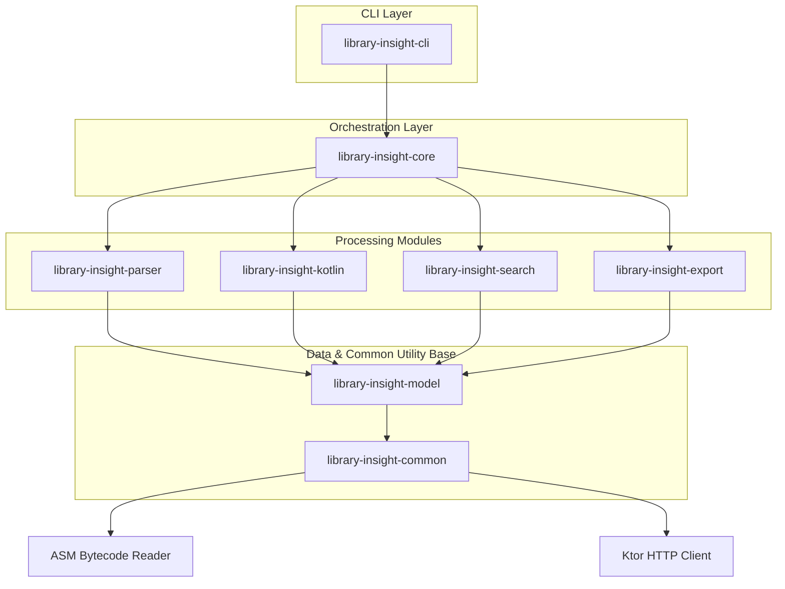

# Library Insight 🔍

AI coding assistants often guess Java/Kotlin library APIs from old docs, latest web examples, or a different version than the one installed in your project. That leads to missing methods, deprecated usage, wrong signatures, and wasted debugging time.

Library Insight fixes that by scanning the exact JAR/AAR, Gradle output, or Maven version you use. It reads compiled `.class` structures (using ASM) and Kotlin `@Metadata` annotations (using `kotlin-metadata-jvm`) to build a searchable, version-correct public API index.

Use it when you need to:

- Know how to implement a library after adding it to a project.
- Check which classes, methods, constructors, and properties exist in your installed version.
- Stop AI from using examples from a newer, older, or undocumented version.
- Find deprecated APIs and compare versions before rewriting code.
- Give AI assistants exact signatures without dumping huge documentation files into context.

> **Core idea:** AI should code against the library version you actually use, not the version it remembers from the web.

---

## Key Features

- **MCP Server**: Connect Cursor, Claude Desktop, or any MCP-compatible IDE. They call `scan_library`, `search_symbols`, and `explain_class` directly without leaving the editor.
- **Multi-Format Support**: Reads JARs, AARs (including nested JARs), directories, and Gradle build outputs.
- **Version-Correct API Lookup**: Scans the exact artifact you point it at, so AI agents and developers see the real public API for that dependency version.
- **Deep Metadata Extraction**: Classes, constructors, methods, properties, generics, Kotlin metadata, suspend keywords, annotations.
- **Migration Advisor**: Compares two versions and reports removed, deprecated, and replacement APIs — great for Retrofit, OkHttp, Compose, and Kotlin upgrades.
- **API Usage Examples**: Auto-generates typical instantiation, builder usage, and method-call code examples from bytecode, and extracts real guide usage examples from README/Dokka markdown files.
- **Package Health & Complexity**: Reports API Health Grades, package topology, largest classes, deep inheritance levels, and generic density parameters.
- **Dependency Conflict/ABI Detector**: Scans transitive bytecode call instructions to highlight potential runtime `LinkageError` and `NoSuchFieldError` conflicts.
- **API Call Graph**: Generates a recursive tree of internal library methods invoked by a target method using bytecode instructions traversal.
- **Dependency API Audit**: Scans project Gradle dependencies and reports deprecated APIs found in installed bytecode.
- **Dependency Graph**: Renders a recursive visual tree of transitive dependencies from POM descriptors.
- **SemVer Checker**: Lints version bumps against actual code changes to catch unbumped breaking changes.
- **Kotlin DSL Support**: Renders lambda signatures in human-readable Kotlin syntax `(A) -> B`, extracts type aliases, detects `@DslMarker` scopes, marks `reified` type parameters, and provides a dedicated `dsl-report` command for DSL-heavy libraries.
- **Search Maven Central**: Find coordinates and latest versions without leaving the terminal.
- **Format Exporters**: Converts API indices to structured **JSON** or readable **Markdown** reference docs.
- **AI-Context Exporter**: Generates a compact, token-efficient `ai-context/` directory for LLMs — 95%+ smaller than a raw dump.

---

## Why This Exists

When you add a dependency, the first question is simple: "How do I use this version correctly?"

In real projects, that answer is often messy:

- AI may write code for the latest release while your project uses an older version.
- AI may copy an old blog post where the method name no longer exists.
- Official docs may be incomplete or not updated for the release you installed.
- Deprecated methods may still appear in examples, while the replacement is hidden in release notes or source comments.
- Huge generated docs waste AI context and make one class hard to find.

Library Insight turns the compiled library itself into the source of truth. Scan the dependency, then use `search`, `explain`, `diff`, or `ai-export` to give humans and AI agents exact, version-aware API information.

---

## Architecture & Modular Design

Library Insight follows **Clean Architecture** principles. Below is the modular dependency flow:


```mermaid
graph TD
    subgraph CLI Layer
        CLI[library-insight-cli]
    end

    subgraph Orchestration Layer
        CORE[library-insight-core]
    end

    subgraph Processing Modules
        PARSER[library-insight-parser]
        KOTLIN[library-insight-kotlin]
        SEARCH[library-insight-search]
        EXPORT[library-insight-export]
    end

    subgraph Data & Common Utility Base
        MODEL[library-insight-model]
        COMMON[library-insight-common]
    end

    CLI --> CORE
    CORE --> PARSER
    CORE --> KOTLIN
    CORE --> SEARCH
    CORE --> EXPORT

    PARSER --> MODEL
    KOTLIN --> MODEL
    SEARCH --> MODEL
    EXPORT --> MODEL

    MODEL --> COMMON
    COMMON --> ASM[ASM Bytecode Reader]
    COMMON --> KTOR[Ktor HTTP Client]
```

The system is composed of the following modules:

- `library-insight-common`: Utility classes for ZIP/JAR/AAR extraction, Ktor async HTTP engine, and filesystem operations.
- `library-insight-model`: Immutable Kotlin serialization structures representing the API index schema.
- `library-insight-parser`: Raw bytecode structure extraction using **ASM** and JVM signature parsing.
- `library-insight-kotlin`: Kotlin metadata parsing (`kotlin-metadata-jvm`) and JVM bytecode enrichment.
- `library-insight-search`: Index search and query matching logic.
- `library-insight-export`: JSON, Markdown, and AI context formatters.
- `library-insight-core`: Orchestrates scan flows and implements the semantic API diffing engine.
- `library-insight-cli`: Command Line Interface definitions using **Clikt**.

---

## Installation & Setup

### Requirements

- JDK 17 or higher (Required to execute the Java/Kotlin runtime engine)

### Option A: Install via One-Line Shell Installer (Recommended)

You can install the CLI globally on your system instantly with zero Node.js/npm dependencies using the installer script:

```bash
curl -fsSL https://raw.githubusercontent.com/Coding-Meet/Library-Insight/main/install.sh | bash
```

_(Once installed, you can execute the `library-insight` command directly from any folder)._

### Option B: Manual build from source

If you just want to run a local build without global registration:

```bash
./gradlew installDist
```

The executable binary will be generated at:
`./library-insight-cli/build/install/library-insight/bin/library-insight`

### Uninstallation

To cleanly remove the global CLI binary, installation files, and registered AI agent skills from your system:

```bash
curl -fsSL https://raw.githubusercontent.com/Coding-Meet/Library-Insight/main/uninstall.sh | bash
```

---

## AI Agent Skill Integration

Library Insight bundles a Custom AI Agent Skill (`SKILL.md`) that teaches AI assistants (like Claude, Gemini, Cursor, Copilot, Junie, etc.) to verify real dependency APIs before writing code.

The skill is designed around one rule: do not guess from web examples when the installed library version can be scanned directly. Agents should use `search`, `explain`, `diff`, and `ai-export` to confirm what exists in the actual artifact.

### 1. Global Auto-Integration

When you install the CLI globally via **Option A** (`install.sh`), the installer script automatically copies the agent skill file into your user profile configurations:

- `~/.cursor/skills/library-insight`
- `~/.gemini/config/skills/library-insight`
- `~/.claude/skills/library-insight`
- `~/.agents/skills/library-insight`
- `~/.copilot/skills/library-insight`
- `~/.junie/skills/library-insight`

Any active AI agent running on your computer will instantly discover and utilize the `library-insight` command tree.

### 2. Project Workspace Scoping

If you want to install the skill scoped _only_ to your current project directory (workspace-specific scope), run:

```bash
library-insight init
# or
library-insight skills add
```

This creates `.agents/skills/library-insight/SKILL.md` in the project root, enabling workspace-scoped agents to access the tool.

---

## Quick Start

> [!NOTE]
> These examples assume you have installed the CLI globally. Run `library-insight <command>` from any folder.

```bash
# 1. Scan a library from Maven Central (or picks it from your Gradle cache)
library-insight scan com.squareup.retrofit2:retrofit:2.11.0

# 2. Find a class by name
library-insight search Retrofit

# 3. Inspect full API signatures and docs for a class
library-insight explain Retrofit

# 4. Compare two versions — see what was added, removed, or changed
library-insight diff com.squareup.retrofit2:retrofit:2.9.0 com.squareup.retrofit2:retrofit:2.11.0

# 5. Get a migration report with replacement API suggestions
library-insight migrate com.squareup.retrofit2:retrofit:2.9.0 com.squareup.retrofit2:retrofit:2.11.0

# 6. Audit all project dependencies for deprecated APIs
library-insight audit

# 7. Start the MCP server (connect via Cursor, Claude Desktop, etc.)
library-insight mcp

# 8. Get a Kotlin DSL surface report (type aliases, @DslMarker scopes, lambda receivers)
library-insight dsl-report

# 9. Generate typical API usage examples for a class from signatures
library-insight examples Retrofit

# 10. Generate a detailed Package Health & Complexity Report
library-insight health

# 11. Verify all transitive dependencies for ABI/linkage compatibility conflicts
library-insight dependency-check

# 12. Renders a recursive method invocation call graph
library-insight callgraph Retrofit.Builder.build
```

→ See **[docs/CLI.md](docs/CLI.md)** for the complete command reference (all 21 commands with examples and output).

---


## Repository Directory Structure

Below is the directory structure detailing the key folders and components of the Library Insight project:

```
Library-Insight/
├── .agents/                        # Local workspace AI Agent customizations
│   └── skills/
│       └── library-insight/
│           ├── SKILL.md            # Master Custom AI agent Skill file
│           └── scripts/
│               └── install-cli.sh  # Script to globally install CLI binary
├── buildSrc/                       # Gradle precompiled script plugins for convention builds
│   ├── src/main/kotlin/
│   │   └── kotlin-jvm.gradle.kts   # Shared Kotlin JVM conventions
│   └── build.gradle.kts
├── gradle/
│   ├── wrapper/
│   │   ├── gradle-wrapper.jar
│   │   └── gradle-wrapper.properties
│   └── libs.versions.toml          # Gradle version catalog for shared dependencies
├── gradle.properties               # Gradle build and configuration caching parameters
├── library-insight-cli/
│   ├── src/
│   │   └── main/
│   │       └── kotlin/
│   │           └── com/
│   │               └── meet/
│   │                   └── libraryinsight/
│   │                       └── cli/
│   │                           ├── DatabaseHelper.kt
│   │                           ├── Main.kt
│   │                           └── commands/
│   │                               ├── AiExportCommand.kt
│   │                               ├── AuditCommand.kt
│   │                               ├── CheckCompatCommand.kt
│   │                               ├── ClearCacheCommand.kt
│   │                               ├── DiffCommand.kt
│   │                               ├── DoctorCommand.kt
│   │                               ├── ExplainCommand.kt
│   │                               ├── ExportCommand.kt
│   │                               ├── GraphCommand.kt
│   │                               ├── InitCommand.kt
│   │                               ├── McpCommand.kt
│   │                               ├── MigrateCommand.kt
│   │                               ├── ScanCommand.kt
│   │                               ├── SearchCommand.kt
│   │                               ├── SearchCentralCommand.kt
│   │                               └── SkillsCommand.kt
│   └── build.gradle.kts
├── library-insight-common/
│   ├── src/
│   │   └── main/
│   │       └── kotlin/
│   │           └── com/
│   │               └── meet/
│   │                   └── libraryinsight/
│   │                       └── common/
│   │                           └── ArchiveUtils.kt
│   └── build.gradle.kts
├── library-insight-core/
│   ├── src/
│   │   ├── main/
│   │   │   └── kotlin/
│   │   │       └── com/
│   │   │           └── meet/
│   │   │               └── libraryinsight/
│   │   │                   └── core/
│   │   │                       ├── diff/
│   │   │                       └── LibraryAnalyzer.kt
│   │   └── test/
│   │       └── kotlin/
│   │           └── com/
│   │               └── meet/
│   │                   └── libraryinsight/
│   │                       └── core/
│   │                           └── diff/
│   └── build.gradle.kts
├── library-insight-export/
│   ├── src/
│   │   └── main/
│   │       └── kotlin/
│   │           └── com/
│   │               └── meet/
│   │                   └── libraryinsight/
│   │                       └── export/
│   │                           ├── AiExporter.kt
│   │                           ├── JsonExporter.kt
│   │                           └── MarkdownExporter.kt
│   └── build.gradle.kts
├── library-insight-kotlin/
│   ├── src/
│   │   └── main/
│   │       └── kotlin/
│   │           └── com/
│   │               └── meet/
│   │                   └── libraryinsight/
│   │                       └── kotlin/
│   │                           ├── KotlinMetadataEnricher.kt
│   │                           └── KotlinMetadataParser.kt
│   └── build.gradle.kts
├── library-insight-model/
│   ├── src/
│   │   └── main/
│   │       └── kotlin/
│   │           └── com/
│   │               └── meet/
│   │                   └── libraryinsight/
│   │                       └── model/
│   │                           └── LibraryApiIndex.kt
│   └── build.gradle.kts
├── library-insight-parser/
│   ├── src/
│   │   ├── main/
│   │   │   └── kotlin/
│   │   │       └── com/
│   │   │           └── meet/
│   │   │               └── libraryinsight/
│   │   │                   └── parser/
│   │   │                       ├── BytecodeParser.kt
│   │   │                       ├── RawClassData.kt
│   │   │                       └── SignatureParser.kt
│   │   └── test/
│   │       └── kotlin/
│   │           └── com/
│   │               └── meet/
│   │                   └── libraryinsight/
│   │                       └── parser/
│   │                           └── SignatureParserTest.kt
│   └── build.gradle.kts
├── library-insight-search/
│   ├── src/
│   │   └── main/
│   │       └── kotlin/
│   │           └── com/
│   │               └── meet/
│   │                   └── libraryinsight/
│   │                       └── search/
│   │                           └── SearchEngine.kt
│   └── build.gradle.kts

├── sample/
│   ├── src/
│   │   └── main/
│   │       ├── java/
│   │       │   └── com/
│   │       │       └── meet/
│   │       │           └── sample/
│   │       │               └── JavaLibrary.java
│   │       └── kotlin/
│   │           └── com/
│   │               └── meet/
│   │                   └── sample/
│   │                       └── SampleLibrary.kt
│   └── build.gradle.kts
├── ai-context.json
├── build.gradle.kts
├── gradlew
├── gradlew.bat
├── local.properties
├── metadata-jvm.md
├── README.md
└── settings.gradle.kts
```

---

## License

Copyright 2026 Library Insight Authors. Licensed under the Apache License, Version 2.0.
