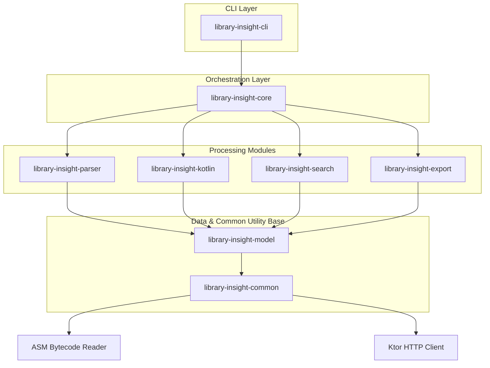

# Architecture & Project Structure

This document describes the architectural style, modular design, and repository layout of **Library Insight**.

---

## Modular Architecture

Library Insight follows **Clean Architecture** principles. The project is split into highly decoupled Kotlin modules to isolate parsing logic, search algorithms, data schemas, and CLI rendering.

Below is the dependency graph showing how modules interface:



### Module Responsibilities

*   `library-insight-common`: Low-level utility classes for ZIP/JAR/AAR archives extraction, Ktor asynchronous HTTP engines, and directory operations.
*   `library-insight-model`: Contains immutable Kotlin serialization structures representing the public API schema (`LibraryApiIndex`).
*   `library-insight-parser`: Performs raw Java bytecode parsing using the **ASM** library, extracting class fields, methods, generic signatures, and structures.
*   `library-insight-kotlin`: Reads and parses compiled Kotlin Metadata header annotations (`@Metadata` via `kotlin-metadata-jvm`) to enrich signatures with Kotlin properties, nullability flags, and suspend keywords.
*   `library-insight-search`: The query/search engine that matches search keywords against compiled packages, classes, constructors, methods, and variables.
*   `library-insight-export`: Exporters that format API indices into target representations: **JSON**, **Markdown** reference documentation, and token-optimized **AI Context** pages.
*   `library-insight-core`: The main orchestration hub. It coordinates the parsing, metadata enrichment, search routines, and calculates API differences/compatibility alerts.
*   `library-insight-cli`: Command Line Interface definitions using **Clikt** mapping option/argument configurations.

---

## Directory Structure

Here is a visual map of the repository's directories and critical files:

```
Library-Insight/
├── .agents/                        # Local workspace AI Agent customizations
│   └── skills/
│       └── library-insight/
│           ├── SKILL.md            # Master Custom AI agent Skill file
│           └── scripts/
│               └── install-cli.sh  # Script to globally install CLI binary
├── buildSrc/                       # Gradle precompiled script plugins for convention builds
│   ├── src/main/kotlin/
│   │   └── kotlin-jvm.gradle.kts   # Shared Kotlin JVM conventions
│   └── build.gradle.kts
├── gradle/
│   ├── wrapper/
│   │   ├── gradle-wrapper.jar
│   │   └── gradle-wrapper.properties
│   └── libs.versions.toml          # Gradle version catalog for shared dependencies
├── gradle.properties               # Gradle build and configuration parameters
├── library-insight-cli/
│   ├── src/
│   │   └── main/
│   │       └── kotlin/
│   │           └── com/
│   │               └── meet/
│   │                   └── libraryinsight/
│   │                       └── cli/
│   │                           ├── DatabaseHelper.kt
│   │                           ├── DslReportGenerator.kt
│   │                           ├── Main.kt
│   │                           └── commands/
│   │                               ├── AiExportCommand.kt
│   │                               ├── AuditCommand.kt
│   │                               ├── CallGraphCommand.kt
│   │                               ├── CheckCompatCommand.kt
│   │                               ├── ClearCacheCommand.kt
│   │                               ├── DependencyCheckCommand.kt
│   │                               ├── DiffCommand.kt
│   │                               ├── DoctorCommand.kt
│   │                               ├── DslReportCommand.kt
│   │                               ├── ExamplesCommand.kt
│   │                               ├── ExplainCommand.kt
│   │                               ├── ExportCommand.kt
│   │                               ├── GraphCommand.kt
│   │                               ├── HealthCommand.kt
│   │                               ├── InitCommand.kt
│   │                               ├── McpCommand.kt
│   │                               ├── MigrateCommand.kt
│   │                               ├── ScanCommand.kt
│   │                               ├── SearchCommand.kt
│   │                               ├── SearchCentralCommand.kt
│   │                               └── SkillsCommand.kt
│   └── build.gradle.kts
├── library-insight-common/
│   ├── src/
│   │   └── main/
│   │       └── kotlin/
│   │           └── com/
│   │               └── meet/
│   │                   └── libraryinsight/
│   │                       └── common/
│   │                           └── ArchiveUtils.kt
│   └── build.gradle.kts
├── library-insight-core/
│   ├── src/
│   │   ├── main/
│   │   │   └── kotlin/
│   │   │       └── com/
│   │   │           └── meet/
│   │   │               └── libraryinsight/
│   │   │                   └── core/
│   │   │                       ├── diff/
│   │   │                       └── LibraryAnalyzer.kt
│   │   └── test/
│   │       └── kotlin/
│   │           └── com/
│   │               └── meet/
│   │                   └── libraryinsight/
│   │                       └── core/
│   │                           └── diff/
│   └── build.gradle.kts
├── library-insight-export/
│   ├── src/
│   │   └── main/
│   │       └── kotlin/
│   │           └── com/
│   │               └── meet/
│   │                   └── libraryinsight/
│   │                       └── export/
│   │                           ├── AiExporter.kt
│   │                           ├── JsonExporter.kt
│   │                           └── MarkdownExporter.kt
│   └── build.gradle.kts
├── library-insight-kotlin/
│   ├── src/
│   │   └── main/
│   │       └── kotlin/
│   │           └── com/
│   │               └── meet/
│   │                   └── libraryinsight/
│   │                       └── kotlin/
│   │                           ├── KotlinMetadataEnricher.kt
│   │                           └── KotlinMetadataParser.kt
│   └── build.gradle.kts
├── library-insight-model/
│   ├── src/
│   │   └── main/
│   │       └── kotlin/
│   │           └── com/
│   │               └── meet/
│   │                   └── libraryinsight/
│   │                       └── model/
│   │                           └── LibraryApiIndex.kt
│   └── build.gradle.kts
├── library-insight-parser/
│   ├── src/
│   │   ├── main/
│   │   │   └── kotlin/
│   │   │       └── com/
│   │   │           └── meet/
│   │   │               └── libraryinsight/
│   │   │                   └── parser/
│   │   │                       ├── BytecodeParser.kt
│   │   │                       ├── RawClassData.kt
│   │   │                       └── SignatureParser.kt
│   │   └── test/
│   │       └── kotlin/
│   │           └── com/
│   │               └── meet/
│   │                   └── libraryinsight/
│   │                       └── parser/
│   │                           └── SignatureParserTest.kt
│   └── build.gradle.kts
├── library-insight-search/
│   ├── src/
│   │   └── main/
│   │       └── kotlin/
│   │           └── com/
│   │               └── meet/
│   │                   └── libraryinsight/
│   │                       └── search/
│   │                           └── SearchEngine.kt
│   └── build.gradle.kts
├── sample/
│   ├── src/
│   │   └── main/
│   │       ├── java/
│   │       │   └── com/
│   │       │       └── meet/
│   │       │           └── sample/
│   │       │               └── JavaLibrary.java
│   │       └── kotlin/
│   │           └── com/
│   │               └── meet/
│   │                   └── sample/
│   │                       └── SampleLibrary.kt
│   └── build.gradle.kts
└── settings.gradle.kts
```
