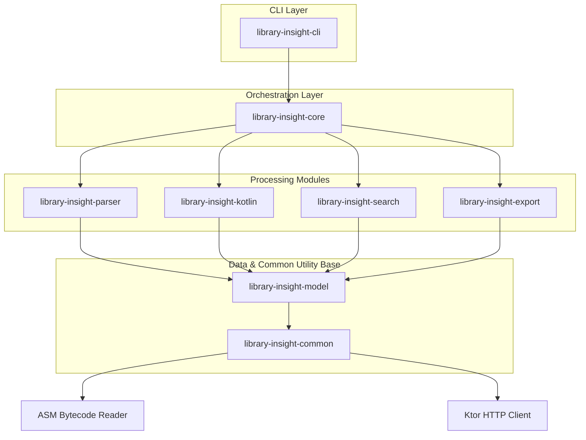

# Library Insight 🔍

### Works as both a standalone CLI and an MCP server for AI IDEs like Cursor and Claude Desktop.

AI coding assistants often guess Java/Kotlin library APIs from old docs, latest web examples, or a different version than the one installed in your project. That leads to missing methods, deprecated usage, wrong signatures, and wasted debugging time.

**Library Insight** fixes that by scanning the exact JAR/AAR, Gradle output, or Maven version you use. It reads compiled `.class` structures (using ASM) and Kotlin `@Metadata` annotations (using `kotlin-metadata-jvm`) to build a searchable, version-correct public API index.

Because it analyzes the compiled artifacts actually used by your project, the reported APIs always match the installed version rather than online documentation or outdated examples.

---

## Key Features

- 🔍 Search packages, classes, methods, and properties
- 📖 Explain APIs with signatures, documentation, and examples
- 🔄 Compare library versions and detect breaking changes
- 🚀 Generate migration reports
- 🧩 Analyze Kotlin DSLs and fluent APIs
- 🌳 Visualize dependency graphs and method call graphs
- 🚨 Detect dependency ABI conflicts before runtime
- 🤖 Integrate with Cursor, Claude Desktop, and other AI IDEs via MCP

---

## Why Library Insight?

When you add a dependency, the first question is simple: _"How do I use this version correctly?"_

In real projects, that answer is often messy:

- **Outdated AI Context**: AI may write code for the latest release while your project uses an older version.
- **Incorrect Web Examples**: AI may copy an old blog post where the method name no longer exists.
- **Incomplete Docs**: Official docs may be incomplete or not updated for the release you installed.
- **Hidden Replacements**: Deprecated methods may still appear in examples, while the replacement is hidden in release notes or source comments.
- **Context Waste**: Huge generated docs waste AI context and make one class hard to find.

Library Insight turns the **compiled library itself** into the source of truth. Scan the dependency, then use `search`, `explain`, `diff`, or `ai-export` to give humans and AI agents exact, version-aware API information.

---

## Architecture & Modular Design

Library Insight follows Clean Architecture principles. Below is the modular dependency flow:

---

## Core Modules

- `library-insight-common`: Utility classes for ZIP/JAR/AAR extraction, Ktor async HTTP engine, and filesystem operations.
- `library-insight-model`: Immutable Kotlin serialization structures representing the API index schema.
- `library-insight-parser`: Raw bytecode structure extraction using **ASM** and JVM signature parsing.
- `library-insight-kotlin`: Kotlin metadata parsing (`kotlin-metadata-jvm`) and JVM bytecode enrichment.
- `library-insight-search`: Index search and query matching logic.
- `library-insight-export`: JSON, Markdown, and AI context formatters.
- `library-insight-core`: Orchestrates scan flows and implements the semantic API diffing engine.
- `library-insight-cli`: Command Line Interface definitions using **Clikt**.

---

## 🚀 Roadmap

We plan to expand Library Insight into a unified **Kotlin Multiplatform (KMP)** API explorer:

- **KLib Metadata Reader**: Parse `.klib` metadata to extract signatures for iOS/Native, JS, and Wasm targets directly (bypassing JVM bytecode dependencies).
- **Platform-Aware Indexing**: Store platform target markers (`common`, `jvm`, `ios`, `js`, `wasm`) in the database schema so AI agents know exactly where APIs are available.
- **KMP Coordinate Resolution**: Auto-resolve platform split coordinates (e.g. `ktor-client-core-iosarm64`) from the root KMP library Maven coordinate.
