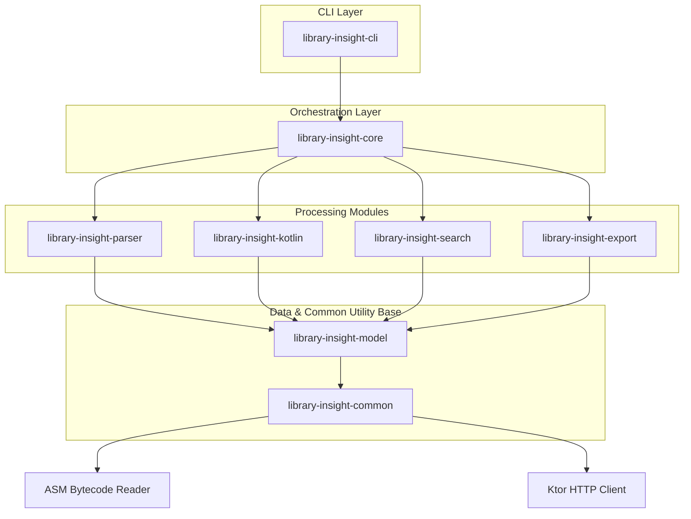

--8<-- "README.md:intro"

---

## Key Features

--8<-- "README.md:features"

---

## Why Library Insight?

When you add a dependency, the first question is simple: _"How do I use this version correctly?"_

In real projects, that answer is often messy:

- **Outdated AI Context**: AI may write code for the latest release while your project uses an older version.
- **Incorrect Web Examples**: AI may copy an old blog post where the method name no longer exists.
- **Incomplete Docs**: Official docs may be incomplete or not updated for the release you installed.
- **Hidden Replacements**: Deprecated methods may still appear in examples, while the replacement is hidden in release notes or source comments.
- **Context Waste**: Huge generated docs waste AI context and make one class hard to find.

Library Insight turns the **compiled library itself** into the source of truth. Scan the dependency, then use `search`, `explain`, `diff`, or `ai-export` to give humans and AI agents exact, version-aware API information.

---

## Architecture & Modular Design

Library Insight follows Clean Architecture principles. Below is the modular dependency flow:

---

## Core Modules

- `library-insight-common`: Utility classes for ZIP/JAR/AAR extraction, Ktor async HTTP engine, and filesystem operations.
- `library-insight-model`: Immutable Kotlin serialization structures representing the API index schema.
- `library-insight-parser`: Raw bytecode structure extraction using **ASM** and JVM signature parsing.
- `library-insight-kotlin`: Kotlin metadata parsing (`kotlin-metadata-jvm`) and JVM bytecode enrichment.
- `library-insight-search`: Index search and query matching logic.
- `library-insight-export`: JSON, Markdown, and AI context formatters.
- `library-insight-core`: Orchestrates scan flows and implements the semantic API diffing engine.
- `library-insight-cli`: Command Line Interface definitions using **Clikt**.

---

## 🚀 Roadmap

--8<-- "README.md:roadmap"
